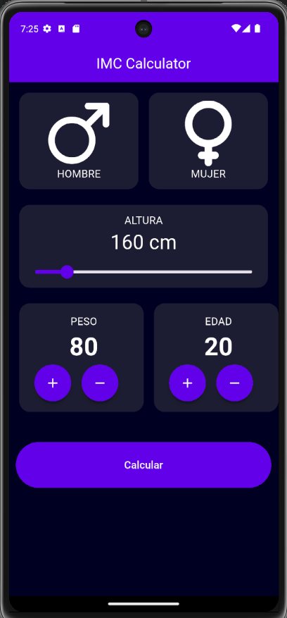
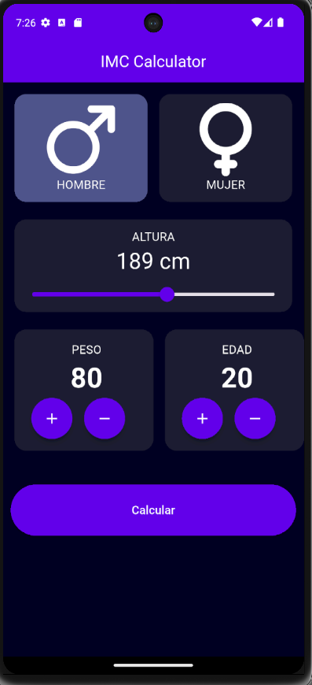

# IMC Calculator 📱

Aplicación Flutter que calcula el Índice de Masa Corporal (IMC) a partir del peso, altura, edad y género del usuario.

## Capturas de pantalla

| Home | Configurado | Resultado |
|------|------------|-----------|
|  |  |  |

## Características

- Selección de género (Hombre / Mujer)
- Slider para ajustar la altura
- Botones +/- para peso y edad
- Navegación entre pantallas
- Resultado con categoría de IMC y mensaje personalizado

## Tecnologías

- Flutter / Dart
- StatefulWidget
- Navigator para navegación entre pantallas
- Diseño oscuro personalizado

## Cómo ejecutar

```bash
flutter pub get
flutter run
```
